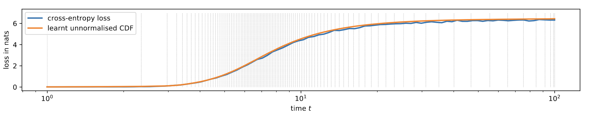
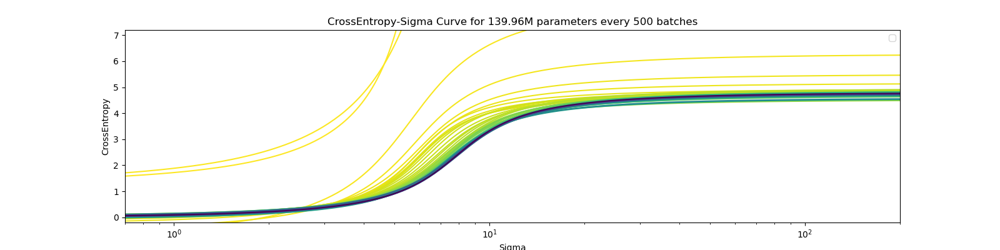
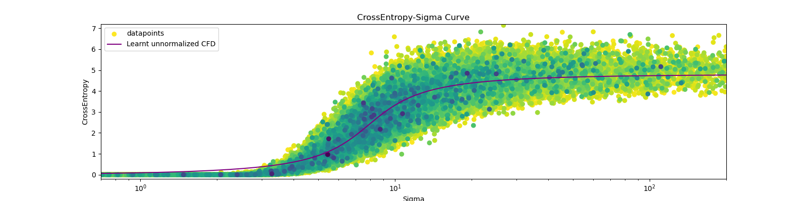

# Continuous Diffusion for Nucleotide Data

This repository aims to reproduce the paper [Continuous Diffusion from Categorical Data (CDCD)](https://arxiv.org/pdf/2211.15089.pdf) by Dieleman et al., in which the authors manage to generate coherent text non-autoregressively using a diffusion transformer-based architecture trained with cross-entropy loss. We then apply this to modeling nucleotide data, starting with DNA.

Diffusion for categorical data requires a handful of new tricks, and a few are worth noting: 

### Adaptive Noise Scheduling
One novel contribution of the CDCD paper is the use of "time-warping", which is motivated by the difficulties of cross-entropy loss-based training of diffusion models:

> Diffusion models are essentially denoisers that can operate at many different noise levels with a single set of shared parameters. Therefore, the degree to which the model dedicates capacity to different noise levels has a significant impact on the perceived quality of the resulting samples. We can control this by appropriately weighting the noise levels during training... We note that our use of the cross-entropy loss, while conveying many benefits (such as stability and end-to-end training), also changes the relative weighting of the noise levels corresponding to different timesteps $t$. Because the effects of this change are difficult to quantify, we seek to determine a time reweighting strategy that maximises sample quality

For the noise scheduling, Dieleman et al. use a linear schedule $\sigma(t)=t$, where $t > 0$, as explained in [Elucidating the Design Space of Diffusion-Based Generative Models](https://arxiv.org/pdf/2206.00364.pdf).

To sample timesteps from this schedule, they fit a monotonic [piece-wise linear function](https://en.wikipedia.org/wiki/Piecewise_linear_function) to the model's cross entropy loss over predicted tokens, $S$, as a function of the noise level, $\sigma$. They then use this $S(\sigma)$ as an unormalized Cumulative Density Function (CDF), $F(t)$, to "warp" timesteps sampled uniformly from the interval $[0,1]$ into the desired distribution. 

What's especially novel is that $S(\sigma)$ is periodically refit over the course of training: as the model's predictions improve, it shifts its sampling to higher timesteps/noise levels, focusing its learning on more difficult denoising problems. 

We instead opt to fit $F(t)$ with a [Cauchy-like](https://en.wikipedia.org/wiki/Cauchy_distribution) function, since it is simpler and more efficient.

We find that when training on natural language, the sigma-entropy curve of our model converges to one similar to that in the CDCD paper (lighter colors are earlier in training, darker colors later). The curve progressively shifts rightward, sampling noisier, more difficult training points:

These curves are fit to the training datapoints and their losses within a rolling window of batches. Each point here represents a single training example:

### Preconditioning

In [Elucidating the Design Space of Diffusion-Based Generative Models](https://arxiv.org/pdf/2206.00364.pdf), Karras et al. define the output of the model $D_\theta(\boldsymbol x,\sigma)$ as follows (eq. 7 of the paper)

$$D_\theta(\boldsymbol x,\sigma)=c_\textrm{skip}(\sigma)\boldsymbol x + c_\textrm{out}(\sigma)F_\theta(c_\textrm{in}(\sigma)\boldsymbol x,c_\textrm{noise}(\sigma))$$

Where $F_\theta(\cdot)$ is the the actual Transformer and $c_\textrm{skip},c_\textrm{out},c_\textrm{in},c_\textrm{noise}$ are non-trainable modulation functions. Here's how these function compare between this paper, CDCD, and our implementation:

|modulation   |Karras   |CDCD   |ours   |
|---|---|---|---|
|$c_\textrm{skip}(\sigma)$   |  $1/ (1+\sigma^2)$| ?  | $0$ |
|$c_\textrm{out}(\sigma)$  |  $\sigma/\sqrt{1+\sigma^2}$ | ?  | $1$  |
|$c_\textrm{in}(\sigma)$   | $1/\sqrt{1+\sigma^2}$  | $1/\sqrt{1+\sigma^2}$  |$1/\sqrt{1+\sigma^2}$   |
|$c_\textrm{noise}(\sigma)$   | $\ln(\sigma)/4$  | ?  | $\ln(\sigma)/4$  |

> Sources: [Details in section 6.1 of the CDCD paper](https://arxiv.org/pdf/2211.15089.pdf) and [table 1 of Karras paper](https://arxiv.org/pdf/2206.00364.pdf). Any discrepancies with the Karras paper are due to the fact that we have $\sigma_\textrm{data}=1$, which is caused by how we initialize the input embeddings.

We found that the choice of the modulation function has a large effect on training stability and eventual loss.

## Pseudocode for Score interpolation

Since in the original CDCD paper there is no code explanation for the score interpolation technique, another critical contribution of the paper used when generating with the model, we provide the pseudocode here (for the unconditional case without self-conditioning):

**Generation**$(D_{\theta}(x;t)$, $e_{j\in \{0,\ldots,V-1\}}$, $t_\textrm{max},t_\textrm{min}, N)$

1. $S_i\gets \textrm {Uniform}(F(t_\textrm{max}),F(t_\textrm{min}), N)$ // Generate $N$ uniformly distributed samples $S_i$ between $F(t_\text{max})$
2. $t_i \leftarrow F^{-1}(S_i)$ // Inverse transform sampling to get times  
3. $x_0 \sim \mathcal{N}(0, t_0^2 I)$ // Initialize $x_0$ with noise based on max time variance
4. **For** $i \in \{0,\dots, N-1\}$ **do**:
    - $\hat x_0 \leftarrow D_{\theta}(x_i; t_i)$ // Apply model to estimate completely denoised image $\hat x_0$
    - $p_j(\hat x_0) \leftarrow \text{Softmax}(\hat x_0 \cdot e_j)$ // Softmax to get probabilities of embeddings
    - $\mathbf E_{p} [\hat x_0] \leftarrow \sum_{j}e_jp_j(\hat x_0)$ // Calculate expected embedding 
    - $d_i \leftarrow \frac{x_i - \mathbf E_{p} [\hat x_0]}{t_i}$ //  Compute derivative 
    - $x_{i+1} \leftarrow x_i + (t_{i+1} - t_i) d_i$ // Euler step for next sample
5. **Return** $x_N$ // return generated sample

## Future Additions
We will soon add our DNA results, including performance on genomics benchmarks.
